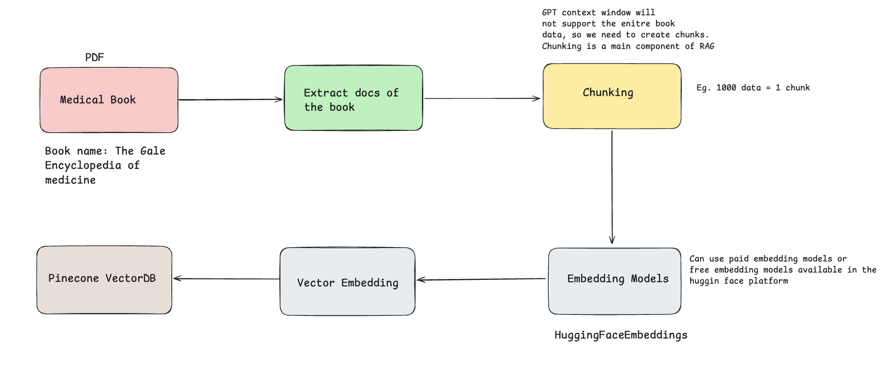
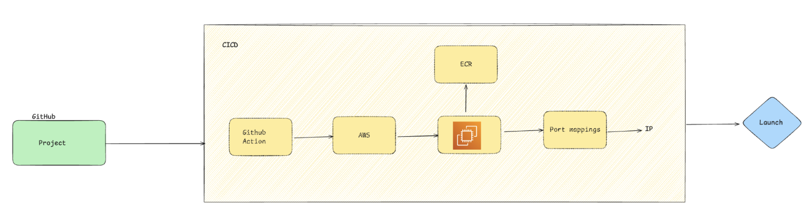

# Medibot



### Tech stack
- Python
- OpenAI/Groq Model
- Langchain
- PineCone (VectorDB)
- Flask
- Docker
- Github Actions
- AWS
    - CICD Deployment
    - EC2 (Elastic Compute Cloud)
    - ECR (Elastic Container Registry)



### Create a conda enviroment 

```bash
conda create -n medibot python=3.13.5 -y
```

```bash
conda activate medibot
```

### Install requirements
```bash
pip3 install -r requirements.txt
```

### Create .env 
```bash
PINECONE_API_KEY = "xxxxxxxxxxxxxxxxxxxxxxxxxxxxx"
OPENAI_API_KEY = "xxxxxxxxxxxxxxxxxxxxxxxxxxxxx"
```

### Store embeddings to pinecode
```bash
python store_index.py
```

### Running app locally
```bash
python app.py
```

### Deployment Steps (AWS-CICD-Deployment-with-Github-Actions)

```bash
1. Login to AWS console.

2. Create IAM user for deployment

	#with specific access

	* EC2 access : It is virtual machine

	* ECR: Elastic Container registry to save your docker image in aws


	#Description: About the deployment

	* Build docker image of the source code

	* Push your docker image to ECR

	* Launch Your EC2 

	* Pull Your image from ECR in EC2

	* Lauch your docker image in EC2

	#Policy:

	* AmazonEC2ContainerRegistryFullAccess

	* AmazonEC2FullAccess

	
3. Create ECR repo to store/save docker image
    - Save the URI: <ECS URI>

	
4. Create EC2 machine (Ubuntu) 

5. Open EC2 and Install docker in EC2 Machine:
	
	
	#optinal

	sudo apt-get update -y

	sudo apt-get upgrade
	
	#required

	curl -fsSL https://get.docker.com -o get-docker.sh

	sudo sh get-docker.sh

	sudo usermod -aG docker ubuntu

	newgrp docker
	
6. Configure EC2 as self-hosted runner:
    setting>actions>runner>new self hosted runner> choose os> then run command one by one


7. Setup github secrets:

   - AWS_ACCESS_KEY_ID
   - AWS_SECRET_ACCESS_KEY
   - AWS_DEFAULT_REGION
   - ECR_REPO
   - PINECONE_API_KEY
   - OPENAI_API_KEY

```